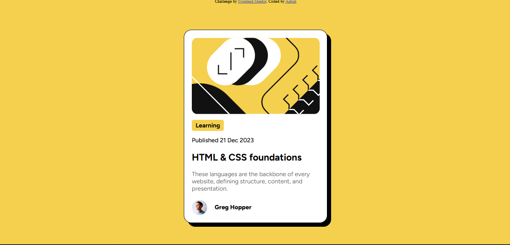

# Frontend Mentor - Blog preview card solution

This is a solution to the [Blog preview card challenge on Frontend Mentor](https://www.frontendmentor.io/challenges/blog-preview-card-ckPaj01IcS). Frontend Mentor challenges help you improve your coding skills by building realistic projects. 

## Table of contents

- [Overview](#overview)
  - [The challenge](#the-challenge)
  - [Screenshot](#screenshot)
  - [Links](#links)
  - [Built with](#built-with)
  - [What I learned](#what-i-learned)
- [Author](#author)

### The challenge

Users should be able to:

- See hover and focus states for all interactive elements on the page

### Screenshot



### Links

- Solution URL:[https://github.com/AatishAsh/blog-preview-card-main]
- Live Site URL: [https://aatishash.github.io/blog-preview-card-main/]

### Built with

- Semantic HTML5 markup
- CSS custom properties
- Flexbox


### What I learned

- i learned few concepts in HTML and CSS:
- HTML:
- learned about the <article> tag, which is used for self contained content like this blog card
- learned about the <span>tag
- CSS:
- learned about the display:flex property and how it changes the layout behavior of elements
, @font-face to use the local fonts and hover effects
```html
<article class="card"></article>
<span class="tag">Learning</span>
```
```css
.wrapper{
    display: flex;
    justify-content: center;
    align-items: center;
    height: 100%;
    font-family: Figtree , sans-serif;
}
@font-face {
    font-family:'Figtree' ;
    src: url(/assets/fonts/Figtree-VariableFont_wght.ttf);
}

```

## Author

- Frontend Mentor - [@AatishAsh](https://www.frontendmentor.io/profile/AatishAsh)


